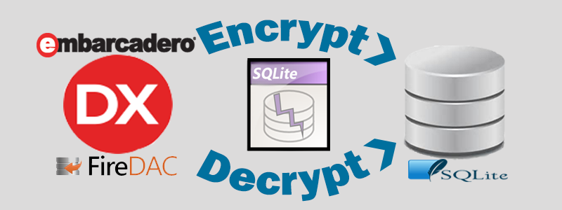
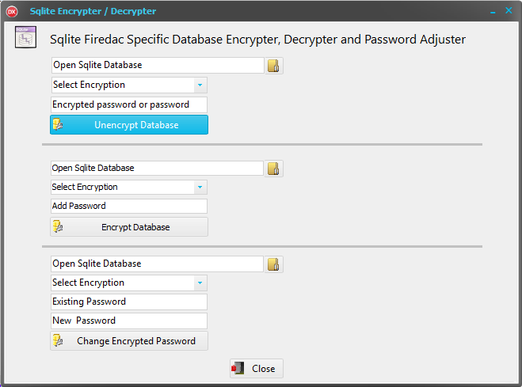

**Delphi Encrypting and Decrypting Tool for a SQLite Database**

The Firedac SQLite component is encryption ready and is totally unique to Delphi
. When connecting in encryption mode in your application, the database linking
becomes more integrated and once coded, it is better to continue with your
encrypted code as it requires a bit of recoding to compile again as a non-
encrypted setup.

Here is an example of production styled code used in the Data module for SQLite.
The connection definitions use the ‘**params**’ method to hard code the
connection. It allows for the connection to find the database in your
development folder when running in Debug mode and then in Non-Debug mode it will
look for the Database in the folder where you would deploy it to. As this is
Pre- XE5 level coding, it is not targeting mobile ( **TPath** is not used in
this instance) but targeting a Windows X64 and X86 set-up. There are many other
options to select such as :- aes-128 ,aes-192, aes-256,aes-ctr-128 ,aes-ctr-192
, aes-ctr-256 ,aes-ecb-128 , aes-ecb-192 , aes-ecb-256.

The following code snippit is based on an **AES- 256 database encryption
level**.

\<Code\>

type

..

..

function GetDBPath: String;

procedure ConnecttoDB;

procedure DataModuleCreate(Sender: TObject);

private

function DBpath:string;

{ Private declarations }

public

{ Public declarations }

end;

Const DriverID:String = 'SQLite';

SHGFP\_TYPE\_CURRENT = 0;

var

dm: Tdm;

path: array [0 .. Max\_Path - 1] of Char;

implementation

{ %CLASSGROUP 'Vcl.Controls.TControl' }

{\$R \*.dfm}

procedure TdM.ConnecttoDB;

begin

FDConnection1.Params.Clear;

FDConnection1.Connected := False;

FDConnection1.DriverName := 'sqlite';

FDConnection1.Params.add('DriverID=' + DriverID);

FDConnection1.Params.add('Database= ' + DBpath);

FDConnection1.Params.add('Encrypt = aes-256');

FDConnection1.Params.add('password=aes-256:1234'); //1234 is the encrypted
password. Best to use a strong Encryption Key in Production.

FDPhysSQLiteDriverLink1.DriverID := DriverID;

FDSQLiteSecurity1.database := DBpath;

FDSQLiteSecurity1.DriverLink := FDPhysSQLiteDriverLink1;

FDSQLiteSecurity1.Password := 'aes-256:1234';//1234 is the encrypted password

FDConnection1.Params.add('OpenMode = CreateUTF16');

FDConnection1.Params.add('JournalMode = WAL');

FDConnection1.Params.add('LockingMode = Exclusive');//do not want anyone else
connecting at same time.

FDConnection1.Params.add('BusyTimeout = 5000');

FDConnection1.Params.add('CacheSize = 10000');

FDConnection1.Params.add('SharedCache = False');

FDConnection1.Params.add('Synchronous = Off');

FDConnection1.Params.add('ForeignKeys = Off');

FDConnection1.Params.add('StringFormat = Choose');

FDConnection1.Params.add('GUIDFormat = String');

FDConnection1.Params.add('DateTimeFormat = String');

FDConnection1.Params.add('Extentions = False');

FDConnection1.Connected := True;

end;

procedure TDM.DataModuleCreate(Sender: TObject);

begin

FDConnection1.connected:=False;

ConnecttoDB;

end;

function TDM.DBpath:string;

begin

{\$IFDEF DEBUG}

Result := 'E:\\SQLiteCreated.db';

{\$ELSE}

if succeeded(ShGetFolderPathW(0, CSIDL\_LOCAL\_APPDATA, 0, SHGFP\_TYPE\_CURRENT,

path)) then

Result := path + '\\MyGroupAPPFolderName\\MyAppName\\data\\SQLiteCreated.db';

{\$ENDIF}

end;

//Other Options

// CCSIDL\_COMMON\_APPDATA

// CSIDL\_APPDATA - individual user Data

// CSIDL\_MYDOCUMENTS - mydocs /documents

function TDM.GetDBPath: String;

begin

Result := DBpath;

end;

\</Code\>

So which is the easiest process available if the database needs some minor
changes. It is not as simple as making changes in the database in your tried and
tested SQLite Database Tool as you will definitely run into compatibility
issues.

I tend to make use of the open source [SQLite Database
Browser](http://sqlitebrowser.org) to help me develop SQLite databases quickly
without overcomplicating the build. It also requires a non- encrypted Database
to make changes. So how do you overcome this?

The easiest solution is to unencrypt your encrypted Database, make the necessary
changes in your SQLite Database. Then re-encrypting before re-compiling your
Delphi App.

I created a simple Encrypt / Unencrypt and Password Re-name tool using the
provided components in Delphi. As I found it useful to me, it would be useful to
other developers.

I have provided the source code for both AnyDac ( XE4 to Delphi 7) and FireDac
for XE5 and Up . The Source and Binaries are included.

Whilst this application is not complex in design and is easy to create. It just
saves a developer from having to go through the trouble to create it. Feel free
to modify it to your requirements.

This application uses **FDconnection** using ‘params’ ,a
**FDPhysSQLiteDriverLink** and a **FDsqlitesecurity** component.

Below demonstrates some of the code used to create the process of encrypting and
unencrypting of a database.

/\*

First clear any existing params.

Add the built in SQLite driver. No external dll’s required.

Add the Database.

Select the Encryption level. Many levels are provided as per the documentation.

It uses the ‘FDsqlitesecurity .CheckEncryption’ method to confirm encrypted or
unencrypted.

\*/

**procedure TForm1.Button1Click(Sender: TObject);**

begin

>   FDConnection1.Params.Clear;

>   FDConnection1.Connected := False;

>   FDConnection1.Params.add('DriverID=SQLite');

>   FDConnection1.Params.add('Database=' + edit1.text);

>   FDPhysSQLiteDriverLink1.DriverID:= 'SQLite';

>   FDsqlitesecurity1.Database:= edit1.Text;

>   FDsqlitesecurity1.DriverLink:= FDPhysSQLiteDriverLink1;

if( Combobox2.ItemIndex = 0) or (combobox2.itemindex = 1) then

begin

>   FDsqlitesecurity1.Password:=edit3.Text;

>   label3.caption:=edit3.Text;

end

else

begin

>   label3.caption:=combobox2.Items[combobox2.ItemIndex]+':'+edit3.text;

>   FDsqlitesecurity1.Password:=combobox2.Items[combobox2.ItemIndex]+':'+edit3.text;

end;

>   label3.caption:='no password';

>   FDsqlitesecurity1.removepassword;

>   FDConnection1.Params.add('Password='+unencryptedpassword);

>   FDConnection1.Connected := True;

>   FDsqlitesecurity1.password:= '';

>   Showmessage('The Encryption level is: '+FDsqlitesecurity1.CheckEncryption);

end;

**procedure TForm1.SpeedButton1Click(Sender: TObject);**

begin

fileopendialog1.Title:= 'Open SQLite Database File';

edit1.Text:='';

if fileopendialog1.execute then

edit1.text:= fileopendialog1.FileName;

end;

Using this Application makes Decryption an Encrypting a Database quick and
painless.

Happy Coding
